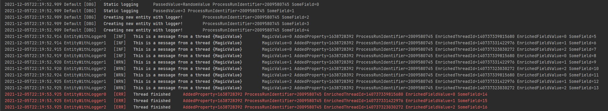
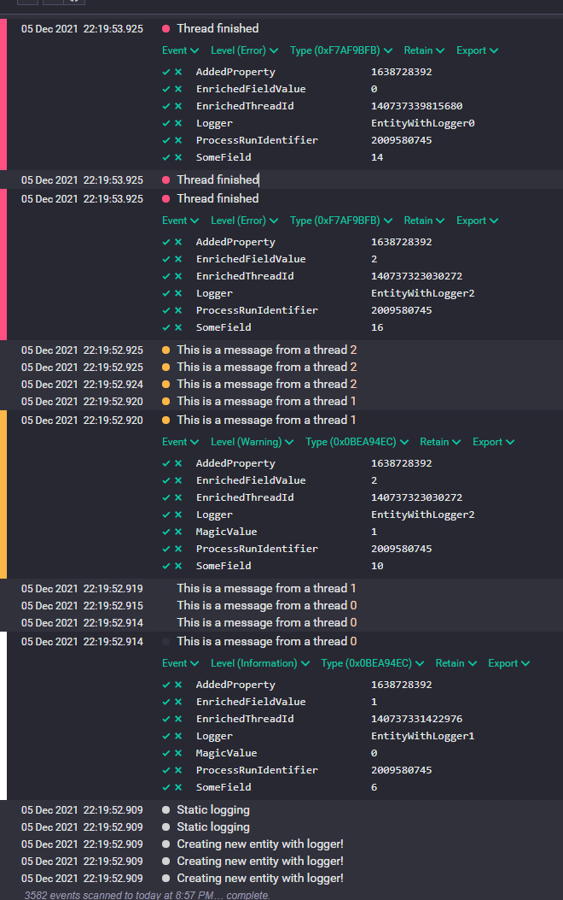

# Header-only SEQ Logging library

Started as a helper in one of my projects, and since I was missing a few things from existing libraries, I made own (although I did use some existing ideas).
Feel free to file PRs with your improvements, those would be greatly appreciated!

> **NOTE**: Standart C++17; For C++14 rewrite inline static variables - definitions somewhere

> **NOTE**: For VS projects you might want to adjust boldification in seq.hpp (`esc_char` and following codes `[1m` and `[0m`)





## Usage

1. Make sure to `::init` seq first - it needs to know where to send logs to:

    ```c++
    #include <seq.hpp>
    
    using namespace seq_logger;
    //                              level of logs to be displayed in console (inherited after init)     
    //        ↓ seq address:port    ↓                                               ↓ dispatch interval, in millis
    seq::init("192.168.0.156:5341", logging_level::verbose, logging_level::verbose, 10000);
    //                                                      ↑ level of logs to be dispatched to seq (inherited after init) 
    ```

    First parameter is console output logging level, second is seq output logging level. Those values are inherited by instanced loggers.

2. Use static methods if you don't really need much for logging:
   
    ```c++
    seq::log_debug("Static logging", {{"PassedValue", "RandomValue"}});
    ```
   
3. Create logger instance if you need cool stuff:
   
    ```c++
     seq_logger::seq log("IAmNamedLogger", {{"AndIAmAKeyValuePair", "Which will be added to all entries from this logger"}});
     ```
   
4.1. seq instance APIs:

* Adjust minimum level of logs to be printed in console with
  
    ```c++
    log.level = seq_logger::logging_level::debug
    ```
  
* Adjust minimum level of logs to be sent to seq with 
  
    ```c++
    log.level_seq = seq_logger::logging_level::debug
    ```
  
* Add enrichers (AKA dynamically-added fields):

    ```c++
    log.add_enricher([&](seq_logger::seq_context &ctx_) {
        ctx_.add("EnrichedField", some_field_captured_the_moment_output_is_printed);
    });
    ```

4.2. `seq_logger::seq::` static APIs:

* Adjust minimum level of logs to be printed in console with (will be inherited if no other preferences specified)
  
    ```c++
    seq_logger::seq::base_level = seq_logger::logging_level::debug
    ```
  
* Adjust minimum level of logs to be sent to seq with (will be inherited if no other preferences specified)
  
    ```c++
    seq_logger::seq::base_level_seq = seq_logger::logging_level::debug
    ```
  
* Add enrichers (AKA dynamically-added fields):
  
    ```c++
    seq_logger::seq::add_shared_enricher([&](seq_logger::seq_context &ctx_) {
        ctx_.add("EnrichedStaticField", some_field_captured_the_moment_output_is_printed);
        ctx_.level++;
    });
    ```

Note that those require a name by design.

## Installation

Add headers from `./src/` to your project.

## Example

Have a look at [example.cpp](./example.cpp)

## Thanks
This library uses [elnormous/HTTPRequest](https://github.com/elnormous/HTTPRequest) for HTTP requests.


